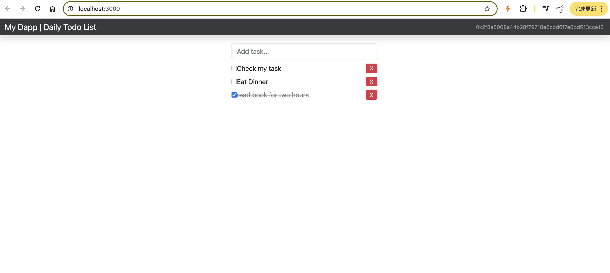
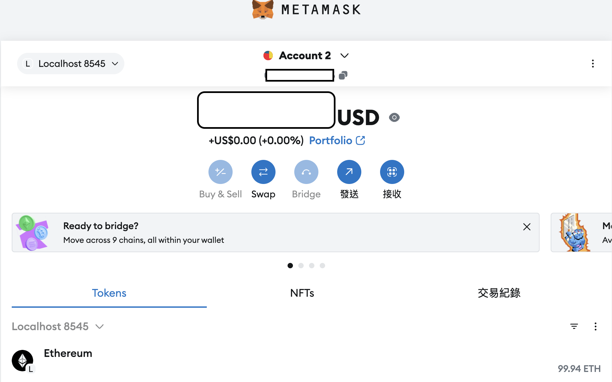
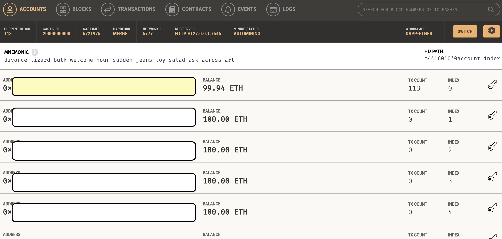

## 區塊鏈待辦事項清單 (Blockchain Todo List)

這是一個基於以太坊區塊鏈的去中心化待辦事項應用（DApp）。使用者可以新增、完成和刪除待辦事項，所有數據都儲存在區塊鏈上。

## 功能特點

- 新增待辦事項
- 標記待辦事項為完成/未完成
- 刪除待辦事項
- 使用MetaMask進行以太坊錢包連接
- 所有操作都記錄在區塊鏈上
- 即時更新狀態
- 事件追蹤與監聽

## 應用截圖

### 主介面


### MetaMask 


### 虛擬帳戶


## 技術

- Solidity (智能合約開發)
- Web3.js (區塊鏈互動)
- Truffle (開發框架)
- Ganache (本地區塊鏈)
- MetaMask (以太坊錢包)
- JavaScript/jQuery (前端開發)
- Bootstrap (UI框架)

## 前置需求

- Node.js (建議版本 >= 12.0.0)
- Truffle (`npm install -g truffle`)
- Ganache
- MetaMask瀏覽器擴展
- 現代瀏覽器（Chrome, Firefox, 等）

## 安裝與設置

1. 克隆專案：
   ```bash
   git clone [專案URL]
   cd eth-todo-list
   ```

2. 安裝依賴：
   ```bash
   npm install
   ```

3. 配置開發環境：
   - 啟動Ganache，確保它運行在`port 7545`
   - 在MetaMask中導入Ganache提供的測試帳戶
   - 將MetaMask連接到Ganache網絡 (HTTP://127.0.0.1:7545)

4. 編譯並部署智能合約：
   ```bash
   truffle compile
   truffle migrate --reset
   ```

5. 運行開發伺服器：
   ```bash
   npm run dev
   ```

## 使用指南

### 初始設置
1. 確保MetaMask已解鎖並連接到Ganache網絡
2. 確認您有足夠的測試以太幣進行交易

### 基本操作
- **新增任務**：在輸入框中輸入內容並按Enter
- **完成任務**：點擊任務旁的複選框
- **刪除任務**：點擊任務右側的X按鈕

### 交易確認
- 每次操作都需要通過MetaMask確認交易
- 等待交易被確認後，介面會自動更新

## 測試

1. 運行智能合約測試：
   ```bash
   truffle test
   ```

2. 測試覆蓋的功能：
   - 合約部署
   - 任務創建
   - 任務狀態切換
   - 任務刪除
   - 事件觸發

   
## 專案結構

```
eth-todo-list/
├── contracts/          # 智能合約程式碼
├── migrations/         # 部署腳本
├── src/               # 前端應用程式碼
├── test/              # 測試檔案
└── truffle-config.js  # Truffle配置
```

